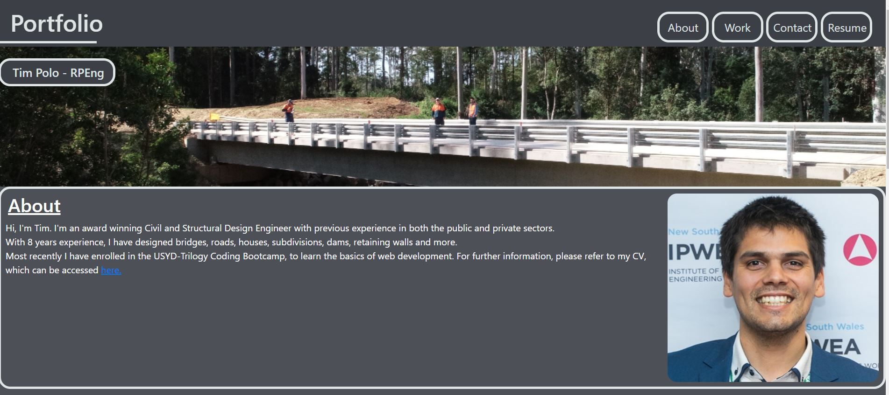

# Portfolio
My portfolio of work
# <Portfolio>

## Site Link

[Live Portfolio Site Link](https://timp1990.github.io/Portfolio/)

## Description

This project displays a website that gives information on my portfolio of work.

- Motivation: 
To showcase my capabilities to future employers.
- Why did you build this project: 
To give future possible employers one place to view some of my key career projects.
- What problem does it solve: 
It shows some of my best work to date.
- What did you learn: 
About front end web development.

## Installation

What are the steps required to install your project? 

No steps are required, the website is live and ready to view

## Usage

The website may be accessed via a web browser. 
An example of the site is shown in the image below.

The items in the nav bar (in the tope right hand corner of the image above) may be clicked to scroll down to the appropriate part of the page.

Clicking on the work images sends the user to news articles about the work, or an address of the work.

## Credits

- Tim Polo

- USYD & Trilogy

- Google Searches

## License

MIT License

Copyright (c) [2022] [Timothy_Polo]

Permission is hereby granted, free of charge, to any person obtaining a copy
of this software and associated documentation files (the "Software"), to deal
in the Software without restriction, including without limitation the rights
to use, copy, modify, merge, publish, distribute, sublicense, and/or sell
copies of the Software, and to permit persons to whom the Software is
furnished to do so, subject to the following conditions:

CONDITION 1: The client (Horiseon) gives their express permission in writing to alter the code.

The above copyright notice and this permission notice shall be included in all
copies or substantial portions of the Software.

THE SOFTWARE IS PROVIDED "AS IS", WITHOUT WARRANTY OF ANY KIND, EXPRESS OR
IMPLIED, INCLUDING BUT NOT LIMITED TO THE WARRANTIES OF MERCHANTABILITY,
FITNESS FOR A PARTICULAR PURPOSE AND NONINFRINGEMENT. IN NO EVENT SHALL THE
AUTHORS OR COPYRIGHT HOLDERS BE LIABLE FOR ANY CLAIM, DAMAGES OR OTHER
LIABILITY, WHETHER IN AN ACTION OF CONTRACT, TORT OR OTHERWISE, ARISING FROM,
OUT OF OR IN CONNECTION WITH THE SOFTWARE OR THE USE OR OTHER DEALINGS IN THE
SOFTWARE. [https://choosealicense.com/](https://choosealicense.com/).

## Badges

## Features

The website allows people to get information about my portfolio of work.

## How to Contribute

[Contributor Covenant](https://www.contributor-covenant.org/) 

## Tests

None.

